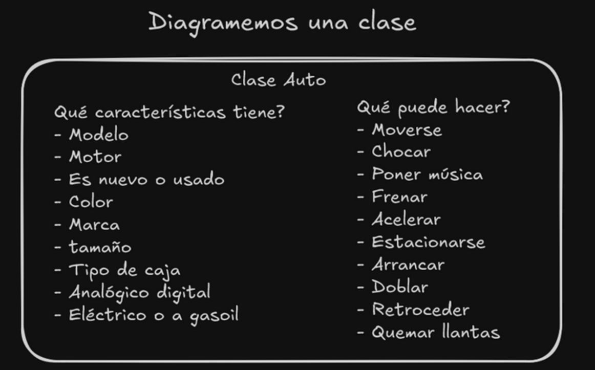

# RESUMEN Y AMPLIACIÓN: INTRODUCCIÓN A POO – CLASES, ATRIBUTOS Y MÉTODOS

# ¿Qué es la programación orientada a objetos?

La Programación Orientada a Objetos es un paradigma de programación que organiza el diseño de software en base a objetos que contienen tanto datos (atributos) como comportamientos (métodos). Estos objetos interactúan entre sí para modelar entidades del mundo real, facilitando la creación de sistemas complejos mediante la modularización y reutilización de código.

## Los 4 pilares de la POO

1. Abstracción
2. Encapsulamiento
3. Herencia
4. Polimorfismo

---

## Abstracción: el primer pilar

La abstracción es el proceso de identificar las características y comportamientos esenciales de un objeto del mundo real para representarlos en un modelo de software, ignorando los detalles irrelevantes para el contexto en el que se está modelando.

Ejemplo:

    Un auto tiene: color, marca, modelo, tipo de motor, etc.

    Un auto puede: arrancar, frenar, acelerar, etc.

Ya conociendo el concepto de abstracción podemos sumergirnos en las Clases de Java.

# Clases, ¿Qué son?

Una clase es una plantilla o prototipo que define la estructura y comportamiento que tendrán los objetos creados a partir de ella. Especifica los atributos (datos) y métodos (operaciones) que compartirán todas sus instancias.

Si lo relacionamos con el concepto de abstracción, también se pueden definir como:

Una clase es una abstracción que representa un concepto del mundo real, capturando sus
características esenciales (atributos) y comportamientos (métodos) en un modelo
computacional.

---

### Definición práctica (por si les resulta más sencillo)

Una clase es un tipo de dato personalizado que agrupa variables (atributos) y
funciones (métodos) relacionadas bajo un mismo nombre, permitiendo crear múltiples
objetos con la misma estructura pero diferentes valores.

## Ejemplos de clases

### Ejemplo de abstracción de una clase Auto


En este ejemplo podemos ver como las características que tiene un objeto del mundo real
pasan a ser los atributos que tendra la clase Auto. Y también, las cosas que es capaz
de hacer pasan a ser los métodos que tendrá.

### Ejemplo de cómo queda la clase Auto

```java
public class Auto {
    // Para modelar en clase
    // Atributos (características)
    String modelo;
    String color;
    boolean esNuevo; // true significa que es nuevo, false que es usado
    String marca;
    boolean esDigital; // true significa que es digital, false que es analógico

    // Métodos, basicamente, que puede hacer un objeto de esta clase
    void arrancar() {
        System.out.println("El auto está arrancando");
    }

    void frenar() {
        System.out.println("El auto frenó.");
    }
    // Como pueden ver, estos métodos no requieren tener un public static al ser
    // declarados, esto es debido a que son metodos de instancia, es decir, que se
    // llaman desde un objeto de la clase.
}
```

Aquí vemos claramente como los atributos y métodos se corresponden con lo identificado
en el proceso de abstracción.

Se destaca que estos métodos no requieren tener un `public static` antes de su tipo de retorno y nombre de la función porque son métodos que podrá ejecutar el objeto
instanciado, a diferencia de los que si lo tenían, que eran métodos de la clase.

## Objeto(instancia)

Un objeto es una instancia concreta de una clase, creada en memoria con new. Cada
objeto tiene sus propios valores para los atributos.

```java
public class Main {
    public static void main(String[] args) {
        // Crear objetos (instancias)
        Auto auto1 = new Auto(); //Aquí está la instanciación con new
        auto1.marca = "Toyota";
        auto1.color = "Rojo";
        auto1.esNuevo = true;

        Auto auto2 = new Auto();
        auto2.marca = "Ford";
        auto2.color = "Azul";
        auto2.esNuevo = false;

        // Llamar métodos
        auto1.arrancar();
        auto2.frenar();
    }
}
```

Como pueden ver en el ejemplo de código, se instancia un objeto de la clase Auto y se
guarda en la variable auto1, que es de tipo Auto.

Los atributos son accedidos por medio del punto (.) y se les es asignado el valor deseado.

Los métodos también son accedidos y ejecutados por medio del punto.

Ahora que entendemos qué son los objetos, veamos los dos tipos de métodos que pueden tener.
<br>
<br>
<br>

## Diferencia entre Métodos de Clase y Métodos de Objeto

📌 Métodos de Objeto (Instancia)

- Pertenecen a cada objeto individual
- Requieren una instancia para ser llamados
- Acceden a los atributos específicos de ese objeto
- No usan la palabra static

📌 Métodos de Clase (Estáticos)

- Pertenecen a la clase misma
- Se llaman directamente sobre la clase (sin necesidad de instancia)
- No pueden acceder a atributos de instancia (solo a atributos estáticos)
- Usan la palabra `static`

```java
public class Calculadora {
    // Atributo de instancia (cada objeto tiene su propio valor)
    private String modelo;

    // Atributo de clase (compartido por todos los objetos)
    private static int totalCalculadoras = 0;

    // Constructor
    public Calculadora(String modelo) {
        this.modelo = modelo;
        totalCalculadoras++;
    }

    // === MÉTODOS DE OBJETO ===
    // Operan sobre atributos de instancia
    public double sumar(double a, double b) {
        System.out.println("Sumando con calculadora: " + this.modelo);
        return a + b;
    }

    public String getModelo() {
        return this.modelo;  // Accede a atributo de instancia
    }

    // === MÉTODOS DE CLASE ===
    // Operan sobre atributos de clase
    public static int getTotalCalculadoras() {
        return totalCalculadoras;  // Accede a atributo estático
    }

    public static double convertirCelsiusAFahrenheit(double celsius) {
        // Método utilitario que no necesita estado de objeto
        return (celsius * 9/5) + 32;
    }
}

```

¿Cómo se ve la diferencia de uso en la clase Main?

```java
public class Main {
    public static void main(String[] args) {
        // === MÉTODOS DE CLASE ===
        // Se llaman directamente sobre la clase
        double fahrenheit = Calculadora.convertirCelsiusAFahrenheit(25);
        int total = Calculadora.getTotalCalculadoras();// <=

        // === MÉTODOS DE OBJETO ===
        // Requieren crear una instancia primero
        Calculadora miCalc = new Calculadora("Científica");
        double resultado = miCalc.sumar(5, 3);
        String modelo = miCalc.getModelo();

        System.out.println("Total de calculadoras: " + Calculadora.getTotalCalculadoras());
    }
}
```

Detalles:

- Observen que los métodos de clase se invocan con: `nombreClase.nombreMetodo`.
- Los métodos del objeto se invocan con: `nombreObjeto.nombreMetodo`.

### Notas importantes

- El método main solo es necesario en la clase desde la que se ejecuta el programa.
- Los métodos de instancia no llevan static.
- Cada objeto mantiene su propio estado (valores de atributos).

<br>

### Explicación de por qué el método main es static

El método main es static porque es el punto de entrada del programa y debe poder ejecutarse antes de que exista cualquier objeto.

🧠 Explicación simple:

Imagina que el método main es como el director de orquesta que llega primero al teatro para preparar todo. Necesita poder empezar a trabajar sin esperar a que lleguen los músicos (los objetos).

```java

public class Programa {
// static = "Puedo funcionar sin necesidad de crear un objeto"
public static void main(String[] args) {
// Aquí empieza todo - ¡aún no existe ningún objeto!
System.out.println("El programa está iniciando...");

        // Recién ahora creamos nuestros primeros objetos
        Auto miAuto = new Auto();
        miAuto.arrancar();
    }
}
```

🔑 Punto clave:

    Sin static: Necesitarías un objeto para llamar al método

    Con static: El método existe desde el principio, independientemente de los objetos

Por eso main es `static`: para que Java pueda empezar a ejecutar tu programa desde CERO, sin requerir que primero crees un objeto.

¿Curiosidad? Esto explica por qué desde el main no puedes acceder directamente a atributos ni métodos no-static de la clase sin crear antes un objeto.
