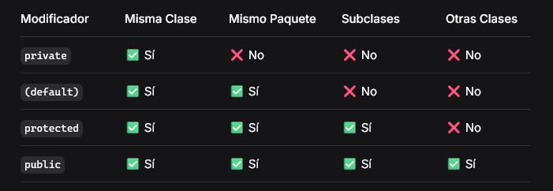

# Encapsulamiento en POO

## 🎯 Introducción al Encapsulamiento

## ¿Qué es el Encapsulamiento?

### Definición técnica:

El encapsulamiento es un principio fundamental de la Programación Orientada a Objetos que consiste en ocultar los detalles internos de una clase y controlar el acceso a sus atributos mediante métodos específicos.

### Definición coloquial:

Es como tener una cápsula que protege los datos importantes de una clase. Solo permitimos que se acceda a ellos mediante "puertas controladas" (métodos) donde podemos verificar que todo esté en orden antes de permitir cualquier cambio.
🔒 Problema Sin Encapsulamiento
Situación Problemática

Ejemplo problemático:

```java

class Rectangulo {
    int base;
    int altura;

    int calcularArea() {
        return base * altura;
    }
}

// Uso problemático
Rectangulo r = new Rectangulo();
r.base = -5;    // ¡Valor negativo!
r.altura = 30;
System.out.println(r.calcularArea()); // ¡Resultado: -150! ✗

```

Problemas identificados:

    ✅ Podemos asignar cualquier valor (incluso inválidos)

    ✅ Accedemos directamente a los atributos sin control

    ✅ Obtenemos resultados incorrectos sin advertencias

## 🛡️ Solución: Modificadores de Acceso

## ¿Qué son los Modificadores de Acceso?

### Definición:

Son palabras clave que controlan desde qué partes del programa se puede acceder a los atributos y métodos de una clase.

Los 4 Modificadores en Java

1. private 🔐

   Accesible solo dentro de la misma clase

   Analogía: Tu diario personal - solo tú puedes leerlo

2. (default) 🏘️

   Accesible dentro del mismo paquete

   Analogía: Jardín compartido entre vecinos del mismo edificio

3. protected 👨‍👩‍👧‍👦

   Accesible dentro del mismo paquete y por subclases

   Analogía: Llaves de casa que le diste a familiares cercanos

4. public 🌍

   Accesible desde cualquier clase

   Analogía: Timbre de tu casa - cualquiera puede usarlo

Tabla Comparativa



## 🏗️ Implementando Encapsulamiento

### Paso 1: Declarar atributos como private

```java

public class Rectangulo {
private int base;
private int altura;

    // ¡Ahora nadie puede acceder directamente!

}
```

### Paso 2: Crear Getters y Setters

¿Qué son los Getters? 📤

    Métodos públicos para leer valores de atributos privados

    Solo devuelven el valor, no lo modifican

¿Qué son los Setters? 📥

    Métodos públicos para escribir valores en atributos privados

    Incluyen validaciones para asegurar datos correctos

Ejemplo Completo

```java

public class Rectangulo {
// Atributos privados
private int base;
private int altura;

    // Constructor
    public Rectangulo(int base, int altura) {
        setBase(base);    // Usamos setters para validar
        setAltura(altura);
    }

    // GETTER para base
    public int getBase() {
        return base;
    }

    // SETTER para base con validación
    public void setBase(int base) {
        if (base > 0) {
            this.base = base;
        } else {
            System.out.println("Error: La base debe ser mayor que 0");
            this.base = 1; // Valor por defecto
        }
    }

    // GETTER para altura
    public int getAltura() {
        return altura;
    }

    // SETTER para altura con validación
    public void setAltura(int altura) {
        if (altura > 0) {
            this.altura = altura;
        } else {
            System.out.println("Error: La altura debe ser mayor que 0");
            this.altura = 1; // Valor por defecto
        }
    }

    // Método para calcular área
    public int calcularArea() {
        return base * altura;
    }

}
```

Uso Correcto ✅

```java

public class Main {
public static void main(String[] args) {
Rectangulo r = new Rectangulo(5, 10);

        // Acceso controlado mediante métodos
        r.setBase(8);           // ✓ Válido
        r.setAltura(-3);        // ✗ Muestra error, asigna 1

        System.out.println("Área: " + r.calcularArea()); // 8 * 1 = 8
        System.out.println("Base: " + r.getBase());      // 8
    }

}
```

## 🔧 Constructores y Palabra this

## ¿Qué es un Constructor?

### Definición:

Método especial que se ejecuta automáticamente al crear un objeto, usado para inicializar atributos.

Características:

    Mismo nombre que la clase

    Sin tipo de retorno (ni void)

    Se ejecuta con new

### Uso de this

Propósito: Referencia al objeto actual, usado para diferenciar atributos de parámetros.

```java

public class Persona {
private String nombre;
private int edad;

    // Constructor usando this
    public Persona(String nombre, int edad) {
        this.nombre = nombre;  // this.nombre = atributo
        this.edad = edad;      // nombre = parámetro
    }

}
```

Mejor Práctica: Reutilizar Setters en Constructores

```java

public class Persona {
private int edad;

    // Constructor que reutiliza validaciones del setter
    public Persona(int edad) {
        setEdad(edad);  // ¡Reutilizamos la validación!
    }

    public void setEdad(int edad) {
        if (edad >= 0) {
            this.edad = edad;
        } else {
            System.out.println("Edad inválida");
            this.edad = 0;
        }
    }

}
```

## 💡 Beneficios del Encapsulamiento

1. Protección de Datos 🛡️

   Evita modificaciones directas e inválidas

   Mantiene la integridad de los datos

2. Control de Acceso 🔐

   Aplicas reglas de negocio en un solo lugar

   Fácil modificación sin afectar otras partes del código

3. Flexibilidad 🔄

   Puedes cambiar la implementación interna sin afectar el exterior

   Fácil de mantener y debuggear

4. Reutilización ♻️

   Código más organizado y reusable

   Validaciones centralizadas

## 🎯 Resumen Visual

```text

CLASE ENCAPSULADA
┌─────────────────────────────────┐
│ Clase Rectangulo                │
│                                 │
│ ┌─ Atributos privados ─┐        │
│ │ - base               │        │
│ │ - altura             │        │
│ └──────────────────────┘        │
│                                 │
│ ┌─ Métodos públicos ─┐          │
│ │ • getBase()        │ ←--- INTERACCIÓN EXTERNA
│ │ • setBase()        │          |
│ │ • getAltura()      │          |
│ │ • setAltura()      │          │
│ │ • calcularArea()   │          │
│ └────────────────────┘          │
└─────────────────────────────────┘
```

📝 Puntos Clave para Recordar

    "Oculta lo que no necesitan ver" - Los atributos deben ser private

    "Controla el acceso" - Usa getters y setters para interactuar con los atributos

    "Valida siempre" - Los setters deben verificar que los datos sean válidos

    "Reutiliza código" - Usa setters en constructores para no repetir validaciones

    "Mantén la coherencia" - Los objetos siempre estarán en un estado válido

¡El encapsulamiento es tu mejor aliado para crear código robusto, mantenible y libre de errores! 🚀
